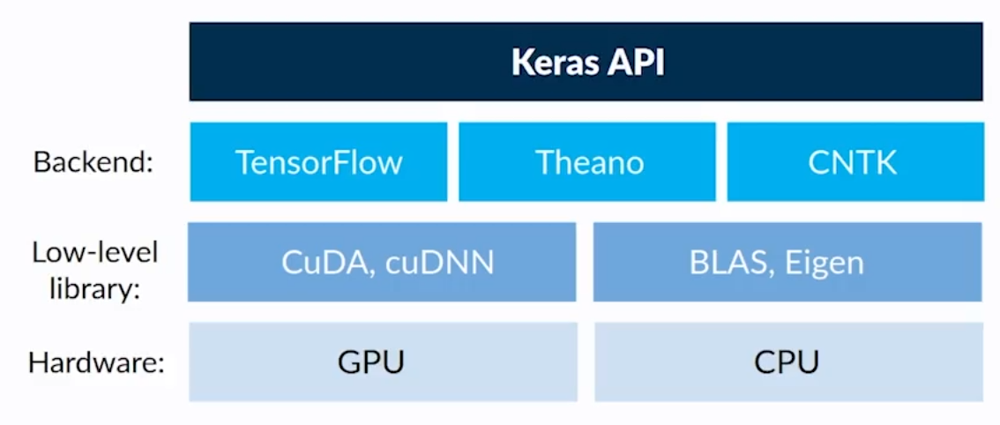

# [Keras](https://keras.io/)

Keras is a **high-level neural networks API**, written in [[Python]] and capable of **running on top of TensorFlow**, **CNTK**, or **Theano**.




## Installation

```bash
pip install keras
```

## Usage

```python
import keras
```

## Models
Keras provides two types of models: **sequential** and **functional**.

### Sequential

Is a linear stack of layers. It can be created by passing a list of layers to the constructor.

```python
from keras.models import Sequential  # sequential model (linear stack of layers)

model = Sequential([
    Dense(32, input_shape=(784,)),
    Activation('relu'),
    Dense(10),
    Activation('softmax'),
])
```

### Functional

Is an arbitrary graph of layers. It can be created by creating an instance of the `Model` class and specifying its inputs and outputs.

```python
from keras.models import Model  # functional model (arbitrary graph of layers)

model = Model(inputs=inputs, outputs=outputs)
```

## Layers

```python
from keras.layers import Dense  # fully connected layer
from keras.layers import Dropout  # dropout layer
from keras.layers import Flatten  # flatten layer
from keras.layers import Input  # input layer
from keras.layers import Conv2D  # convolutional layer
from keras.layers import Embedding  # embedding layer
from keras.layers import Activation  # activation layer
```

