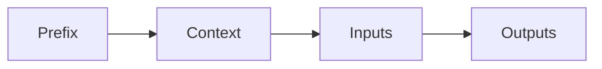

# [Prompt Engineering](https://www.promptingguide.ai/introduction/elements)

Is the process of designing prompts to elicit a desired response from a model. This is a key part of the model development process, and is often the most time-consuming part of the process. The goal of prompt engineering is to create a prompt that will elicit a response that is useful for the task at hand. This can be a difficult task, and there is no one-size-fits-all approach. The following sections describe some of the considerations that should be taken into account when designing a prompt.

## Promts Structure

Prompts are structured as a sequence of tokens. The first token is always the prompt prefix, which is a special token that is used to indicate the start of the prompt.
- prefix is used to distinguish the prompt from the context, and is used to separate the prompt from the context when the model generates a response.

## Prompt Techniques

These are prompts that are designed to work with any model.
- Zero-shot: promts that don't need any information to solve the task. Typically used as a starting point for more specific prompts.
- One-shot: prompts that require only a single example to improve the accuracy of the model.
- Chain-of-Thought: prompts that improve the accuracy of the model by chaining together multiple examples.

